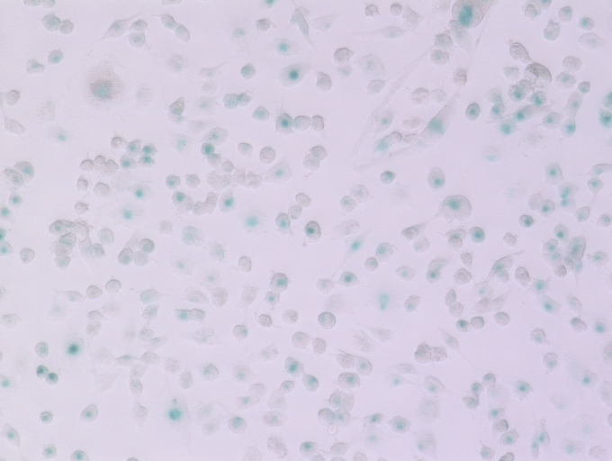

# Order of operations  
**Detect Cells**
1) Shrink the red channel (nearest area interpolation) to get the background gradient of the image
2) Dim the image slightly and subtract it from the original red channel to increase contrast
3) Threshold at the mode (assuming mostly blank space) and erode and dialate repeatedly to reduce noise
4) Draw contours around the cells, and get the convex hull to maximize cell area 
(avoid missing off center beta gal coloration)
5) Remove small "cells" to filter noise
6) Fill in the convex hulls to get mask  
  
**Detect Beta Gal Expression**
1) Subtract the red channel from the blue channel to get areas which are bluer
2) Get the average subtracted blue value and use it threshold the image
3) Mask the image with the detected cells, so only detecting beta gal spots within detected cells
4) erode with a small kernel to remove spot noise, and dilate with a larger one to
fill in any gaps within beta gal spots
5) Find Contours, and filter out any remaining noise contours

# Parameters  
**Required Parameters**  
*-n --name:* Sample name for the output file

**Optional Parameters: Cell Counting**  
*-c --CellSDMulti:* Multiplier for cell counting threshold - higher values are stricter.  
*-C --ContrastMulti:* Determines the magnitude of background image dimming.  
*-g --GResMulti:* Determines how small the gradient image is - large numbers matches subtle gradients while small ones
will preserve large cells.  
*-l --loops:* Number of times to repeat erosion and dilation for cleanup.  
*-m --minCell:* Minimum cell size (square pixels) to be considered a cell.

**Optional Parameters: Beta Gal Counting**  
*-b --BGalSDMulti:* Multiplier for beta gal threshold - higher values are stricter.  
*-M --minBGal:* Minimum beta gal size (square pixels) to be considered true beta gal stain.

**Optional Parameters: Generic Parameters**  
*-i --InputDir:* Directory to look for images. Defaults to current directory.  
*-t --testing:* Flag to display testing images and cell/beta gal distribution histograms.

# Required packages
**Python 3.7.5**
- scipy v1.4.1
- matplotlib v3.1.3
- numpy v1.18.1
- opencv v3.4.2
- argparse v1.1

# Performance
 